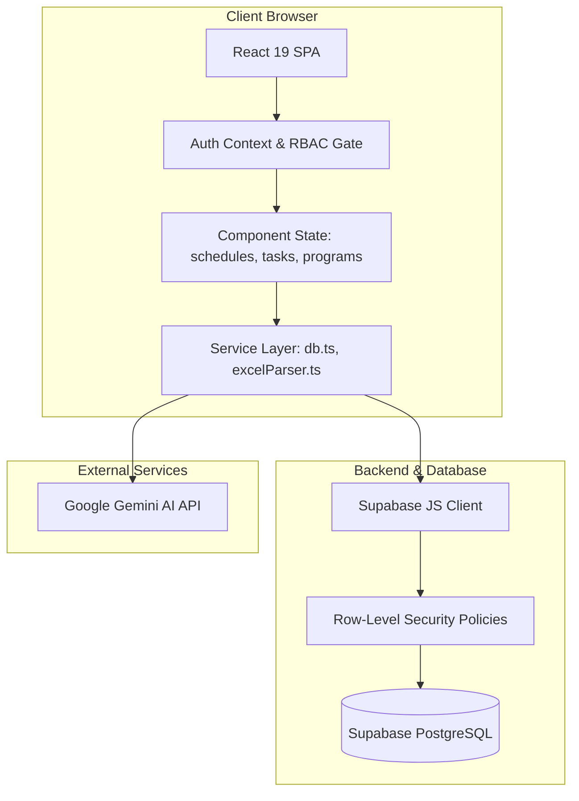
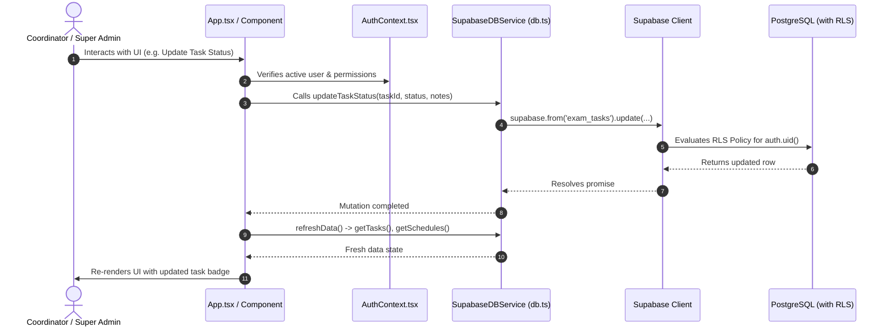

# System Architecture (ARCHITECTURE.md)

## 1. System Overview
**Acharya360 Exam Smart Dashboard** is structured as a modern client-centric Single Page Application (SPA) backed by Supabase PostgreSQL with database-enforced Row-Level Security (RLS).



---

## 2. Tech Stack

| Layer | Technologies | Details |
| :--- | :--- | :--- |
| **Frontend Framework** | React 19 (`react` & `react-dom` 19.0.1) | Functional components with hooks and context state management |
| **Build & Bundler** | Vite 8.3.0 (`@vitejs/plugin-react`) | High-speed ESM development and production rollup bundling |
| **Styling** | Tailwind CSS v4 (`@tailwindcss/vite`) | Next-gen CSS engine with direct `@import "tailwindcss";` |
| **Icons & Visuals** | Lucide React, Canvas Confetti, Motion | Modern icons, interactive animations |
| **Spreadsheet Engine** | SheetJS (`xlsx` 0.18.5) | Client-side parsing and validation of `.xlsx` / `.xls` workbooks |
| **Database & Auth** | Supabase (`@supabase/supabase-js` 2.117.1) | PostgreSQL database, RLS policies, Auth integration |
| **AI Integration** | Google GenAI SDK (`@google/genai` 2.4.0) | Multi-modal and text generation capabilities |
| **Type System** | TypeScript 7.0.2 / Node 22 types | Strict interface and enum typing |

---

## 3. Directory Map & Responsibilities

```
Exam Smart Dashboard/
├── docs/                      # Authoritative project documentation
│   ├── PRD.md                 # Product requirements & user journeys
│   ├── AGENTS.md              # AI agent operating instructions
│   ├── DESIGN_SYSTEM.md       # Visual tokens & UI guidelines
│   ├── ARCHITECTURE.md        # System architecture & data flow
│   ├── SECURITY.md            # RBAC matrix & security boundaries
│   ├── CODE_STYLE.md          # TypeScript & React 19 standards
│   ├── DATABASE.md            # PostgreSQL schemas & RLS policies
│   └── API.md                 # Service methods & Excel parsing contracts
├── src/
│   ├── components/            # Modular React components
│   │   ├── admin/             # ProgramsManager, PasswordManagementModal
│   │   ├── auth/              # LoginScreen
│   │   ├── common/            # AdvancedExamFilter, AdvancedTaskFilter
│   │   ├── dashboard/         # MetricsGrid, ExamTable
│   │   ├── layout/            # Header, Sidebar
│   │   ├── profile/           # ProfileSettingsModal
│   │   ├── schema/            # SqlSchemaViewer
│   │   ├── tasks/             # TasksView (Kanban & Task Management)
│   │   └── upload/            # ExcelUploader (SheetJS Timetable/Mapping Ingest)
│   ├── context/
│   │   └── AuthContext.tsx    # User session, login/logout, RBAC helpers
│   ├── services/
│   │   ├── db.ts              # SupabaseDBService (data access layer)
│   │   ├── excelParser.ts     # SheetJS workbook parser & header normalizer
│   │   ├── sqlGenerator.ts    # SQL schema definitions & DDL strings
│   │   └── supabaseClient.ts  # Supabase client factory
│   ├── types/
│   │   └── index.ts           # Central TypeScript types & enums
│   ├── App.tsx                # Main view router & root state orchestrator
│   ├── main.tsx               # DOM root mount
│   └── index.css              # Tailwind CSS v4 root import
├── schema.sql                 # Complete idempotent PostgreSQL DDL & RLS script
├── package.json               # Dependencies and scripts
└── vite.config.ts             # Vite configuration with Tailwind plugin
```

---

## 4. End-to-End Data Flow



---

## 5. Security & Isolation Architecture

1. **Client-Side Authorization Layer**:
   - `AuthContext` provides helper flags: `isSuperAdmin` (`role in ['COE', 'DYCOE', 'ACOE']`) and `isCoordinator` (`role === 'COORDINATOR'`).
   - `App.tsx` filters available schedules and tasks using program assignments before rendering components.
2. **Server-Side Security Layer**:
   - Even if the client-side UI is tampered with, Supabase PostgreSQL Row-Level Security (RLS) evaluates `auth.uid()` against `public.profiles`, rejecting unauthorized queries at the database tier.

---

## 6. Deployment & Environment Strategy

- **Development**: Run locally via `npm run dev` (Vite dev server at `http://localhost:3000`).
- **Production Build**: Built via `npm run build` targeting `dist/`.
- **Environment Variables**:
  - `VITE_SUPABASE_URL`: Supabase project URL.
  - `VITE_SUPABASE_ANON_KEY`: Supabase anon public key.
  - `GEMINI_API_KEY`: Server-side API key for Google GenAI features.
