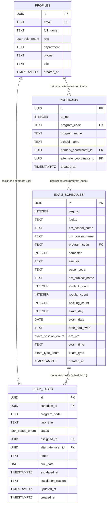

# Database Architecture (DATABASE.md)

## 1. Purpose
This document provides the authoritative database reference for **Acharya360 Exam Smart Dashboard (ExamTrack)**, specifying all PostgreSQL tables, enums, relationships, indexes, and constraints as defined in `schema.sql`.

---

## 2. Database Stack
- **Database Engine**: PostgreSQL 15+ (Hosted on Supabase)
- **Data Access**: `@supabase/supabase-js` PostgREST client
- **Migrations & DDL**: Single idempotent setup script located in [`schema.sql`](file:///d:/Keshav%20Jankar%20Projects/Exam%20Smart%20Dashboard/schema.sql) and embedded in `src/services/sqlGenerator.ts`.

---

## 3. PostgreSQL Enums

```sql
CREATE TYPE user_role_enum AS ENUM ('COE', 'DYCOE', 'ACOE', 'COORDINATOR');
CREATE TYPE exam_session_enum AS ENUM ('AM', 'PM');
CREATE TYPE exam_type_enum AS ENUM ('Regular', 'Backlog', 'Both');
CREATE TYPE task_status_enum AS ENUM ('PENDING', 'IN_PROGRESS', 'COMPLETED', 'ESCALATED_TO_ALTERNATE');
```

---

## 4. Entity Relationship Diagram (ERD)



---

## 5. Core Tables & Schemas

### 5.1. `public.profiles`
Represents university administrative staff and coordinators, directly mirroring `auth.users`.

| Column | Type | Constraints | Description |
| :--- | :--- | :--- | :--- |
| `id` | `UUID` | `PRIMARY KEY REFERENCES auth.users(id) ON DELETE CASCADE` | User unique ID |
| `email` | `TEXT` | `UNIQUE NOT NULL` | Institutional email |
| `full_name` | `TEXT` | `NOT NULL` | Staff member full name |
| `role` | `user_role_enum`| `NOT NULL DEFAULT 'COORDINATOR'` | Role (`COE`, `DYCOE`, `ACOE`, `COORDINATOR`) |
| `department` | `TEXT` | `NULL` | Department name |
| `phone` | `TEXT` | `NULL` | Contact phone number |
| `title` | `TEXT` | `NULL` | Staff job title |
| `created_at` | `TIMESTAMPTZ`| `NOT NULL DEFAULT NOW()` | Record creation timestamp |

- **Indexes**: `CREATE INDEX idx_profiles_role ON public.profiles(role);`

### 5.2. `public.programs`
Academic programs managed by the university examination office.

| Column | Type | Constraints | Description |
| :--- | :--- | :--- | :--- |
| `id` | `UUID` | `PRIMARY KEY DEFAULT gen_random_uuid()` | Unique record ID |
| `sr_no` | `INTEGER` | `NULL` | Display sequence number |
| `program_code` | `TEXT` | `UNIQUE NOT NULL` | Academic code (e.g. `BTECH-CSE`) |
| `program_name` | `TEXT` | `NOT NULL` | Full degree program name |
| `school_name` | `TEXT` | `NOT NULL` | Faculty / School (e.g. `School of Engineering`) |
| `primary_coordinator_id` | `UUID` | `REFERENCES public.profiles(id) ON DELETE SET NULL` | Primary assigned coordinator |
| `alternate_coordinator_id` | `UUID` | `REFERENCES public.profiles(id) ON DELETE SET NULL` | Escalation/backup coordinator |
| `created_at` | `TIMESTAMPTZ`| `NOT NULL DEFAULT NOW()` | Creation timestamp |

- **Indexes**: `idx_programs_code`, `idx_programs_primary`, `idx_programs_alternate`

### 5.3. `public.exam_schedules`
Master university timetable matching Excel scheduling imports.

| Column | Type | Constraints | Description |
| :--- | :--- | :--- | :--- |
| `id` | `UUID` | `PRIMARY KEY DEFAULT gen_random_uuid()` | Schedule ID |
| `pkg_no` | `INTEGER` | `NOT NULL` | Package sequence number |
| `logic1` | `TEXT` | `NULL` | Academic logic classification code |
| `cm_school_name` | `TEXT` | `NOT NULL` | School name |
| `cm_course_name` | `TEXT` | `NOT NULL` | Course title |
| `program_code` | `TEXT` | `NOT NULL REFERENCES public.programs(program_code) ON DELETE CASCADE` | Linked program |
| `semester` | `INTEGER` | `NOT NULL` | Semester number (1-10) |
| `elective` | `TEXT` | `NULL` | Elective stream name if applicable |
| `paper_code` | `TEXT` | `NOT NULL` | Unique exam paper / course code |
| `sm_subject_name` | `TEXT` | `NOT NULL` | Subject examination title |
| `student_count` | `INTEGER` | `NOT NULL DEFAULT 0` | Total registered students |
| `regular_count` | `INTEGER` | `NOT NULL DEFAULT 0` | Regular candidates count |
| `backlog_count` | `INTEGER` | `NOT NULL DEFAULT 0` | Backlog candidates count |
| `exam_day` | `INTEGER` | `NOT NULL DEFAULT 1` | Day offset in timetable cycle |
| `exam_date` | `DATE` | `NOT NULL` | Examination calendar date |
| `date_odd_even`| `TEXT` | `NULL` | Odd / Even day indicator |
| `am_pm` | `exam_session_enum` | `NOT NULL DEFAULT 'AM'` | Session slot (`AM` / `PM`) |
| `exam_time` | `TEXT` | `NOT NULL` | Time interval (e.g. `10:30 am to 12:30 pm`) |
| `exam_type` | `exam_type_enum` | `NOT NULL DEFAULT 'Regular'` | `Regular`, `Backlog`, or `Both` |
| `created_at` | `TIMESTAMPTZ`| `NOT NULL DEFAULT NOW()` | Timetable entry creation time |

- **Indexes**: `idx_exam_schedules_program`, `idx_exam_schedules_date`, `idx_exam_schedules_paper`

### 5.4. `public.exam_tasks`
Operational milestone tasks tracked per scheduled exam.

| Column | Type | Constraints | Description |
| :--- | :--- | :--- | :--- |
| `id` | `UUID` | `PRIMARY KEY DEFAULT gen_random_uuid()` | Task unique identifier |
| `schedule_id` | `UUID` | `NOT NULL REFERENCES public.exam_schedules(id) ON DELETE CASCADE` | Associated exam paper |
| `program_code` | `TEXT` | `NOT NULL` | Associated program code |
| `task_title` | `TEXT` | `NOT NULL` | Milestone task title |
| `status` | `task_status_enum` | `NOT NULL DEFAULT 'PENDING'` | Current workflow status |
| `assigned_to` | `UUID` | `REFERENCES public.profiles(id) ON DELETE SET NULL` | Assigned primary coordinator |
| `alternate_user_id`| `UUID` | `REFERENCES public.profiles(id) ON DELETE SET NULL` | Backup/escalation coordinator |
| `notes` | `TEXT` | `NULL` | Operational activity log notes |
| `due_date` | `DATE` | `NULL` | Milestone target deadline |
| `escalated_at` | `TIMESTAMPTZ`| `NULL` | Timestamp of escalation |
| `escalation_reason`| `TEXT` | `NULL` | Recorded rationale for escalation |
| `updated_at` | `TIMESTAMPTZ`| `NOT NULL DEFAULT NOW()` | Last update timestamp |
| `created_at` | `TIMESTAMPTZ`| `NOT NULL DEFAULT NOW()` | Task creation timestamp |

- **Indexes**: `idx_exam_tasks_schedule`, `idx_exam_tasks_assignee`, `idx_exam_tasks_status`

---

## 6. Migration & Seeding Rules
- **Idempotency**: All DDL commands in `schema.sql` are wrapped with `IF NOT EXISTS` or prefixed by cleanup drop statements.
- **Seeding**: Initial test coordinator and admin users can be provisioned using `auth.users` insertions followed by profile seeds. Real production credentials must never be committed into SQL seed files.
